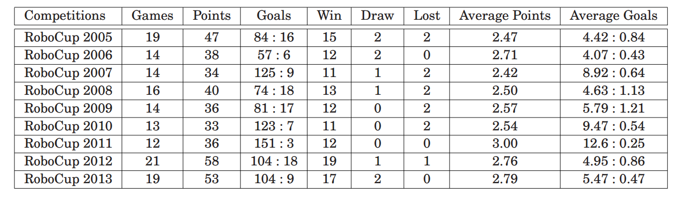
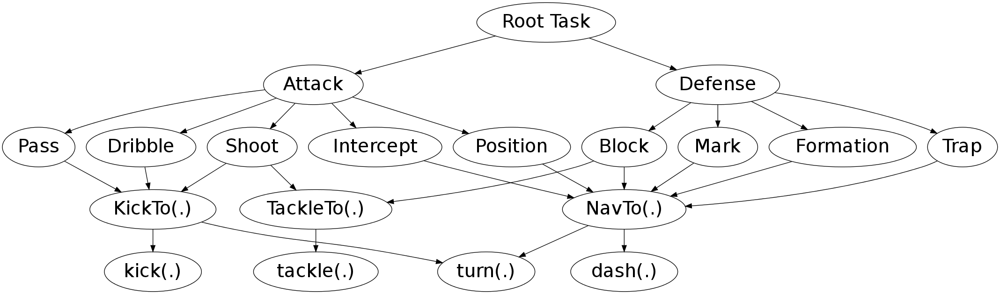

# Romeo

[](https://travis-ci.org/wrighteagle2d/wrighteaglebase)  

This is the code release of Romeo, which is developed from WrightEagleBASE, which serves as the basic framework of [WrightEagle](https://wrighteagle2d.github.io/). Credits goes to WrightEagleBase team.

# Highlights of WrightEagle team

- WrightEagle has won 6 **world champions** and 5 runners-up in annual RoboCup Soccer Simulation 2D competitions since 2005. Detailed historical results from 2005 to 2013 can be found as follows:


- WrightEagle/WrightEagleBASE is developed following the [MAXQ-OP](https://github.com/aijunbai/taxi) online planning algorithm for [Markov Decision Processes](https://en.wikipedia.org/wiki/Markov_decision_process). The [MAXQ-OP](https://github.com/aijunbai/taxi) task structure of the agent:  



# Install
- ```sudo add-apt-repository ppa:gnurubuntu/rubuntu```
- ```sudo apt update```
- ```sudo apt install rcssserver rcssmonitor rcsslogplayer```
- ```git clone https://github.com/wrighteagle2d/wrighteaglebase```


# Compiling
- ```cd romeo```
- Run `make [debug]` for a debug version with debugging information and assertions
- Run `make release` for a release version


# Usages
A [RoboCup Soccer 2D Simulator](https://sourceforge.net/projects/sserver/files/) (as well as a monitor and a logplayer) is needed to run Romeo. Please refer to (https://github.com/rcsoccersim/rcssserver) and (https://github.com/rcsoccersim/rcssmonitor) for installation instructions.  

After installation,  

- Run `rcssserver` to start a soccer server which simulates the game
- Run `rcssmonitor` to start a soccer monitor which is used to display the game
- Run `./start.sh` to start a team on the left side with default teamname *Romeo*
- Run `./start.sh -t [TEAMNAME]` to start a team on the right side with teamname *[TEAMNAME]* (This can varies between different teams)

After both teams are connected, send a `KickOff` command to the server by hitting `Ctrl+K` in the monitor to start the game!

# References

Researchers are encouraged to cite the following selected publications
when using WrightEagleBASE/WrightEagle codes/binaries/tools/materials in
research.

-   **Online planning for large Markov decision processes with
    hierarchical decomposition**, Aijun Bai, Feng Wu, and Xiaoping
    Chen, *ACM Transactions on Intelligent Systems and Technology (ACM
    TIST),6(4):45:1–45:28, July 2015.*
    \[[pdf](http://aijunbai.github.io/publications/TIST15-Bai.pdf)\]
    \[[appendix](http://aijunbai.github.io/publications/TIST15-Bai_app.pdf)\]
    \[[bib](http://aijunbai.github.io/publications/TIST15-Bai.bib)\]
-   **Towards a Principled Solution to Simulated Robot Soccer**, Aijun
    Bai, Feng Wu, and Xiaoping Chen, *RoboCup-2012: Robot Soccer World Cup XVI, Lecture Notes in
    Artificial Intelligence, Vol. 7500, Springer Verlag, Berlin, 2013.*
    \[[pdf](http://aijunbai.github.io/publications/LNAI12-Bai.pdf)\]
    \[[bib](http://aijunbai.github.io/publications/LNAI12-Bai.bib)\]
    \[[slides](http://aijunbai.github.io/slides/LNAI12-Bai_slides.pdf)\]
-   **Online Planning for Large MDPs with MAXQ Decomposition** (Extended
    Abstract), Aijun Bai, Feng Wu, and Xiaoping Chen, *Proceedings of the 11th International Conference on Autonomous
    Agents and Multiagent Systems (AAMAS), Valencia, Spain, June 2012.*
    \[[pdf](http://aijunbai.github.io/publications/AAMAS12-Bai.pdf)\]
    \[[bib](http://aijunbai.github.io/publications/AAMAS12-Bai.bib)\]
    \[[code](https://github.com/aijunbai/maxq-op)\]
-   **WrightEagle and UT Austin Villa: RoboCup 2011 Simulation League
    Champions**, Aijun Bai, Xiaoping Chen, Patrick MacAlpine, Daniel
    Urieli, Samuel Barrett, and Peter Stone, *RoboCup-2011: Robot Soccer World Cup XV, Lecture Notes in
    Artificial Intelligence, Vol. 7416, Springer Verlag, Berlin, 2012.*
    \[[pdf](http://aijunbai.github.io/publications/LNAI11-Bai.pdf)\]
    \[[code](https://github.com/wrighteagle2d/wrighteaglebase)\]
-   **Bounded Incremental Real-Time Dynamic Programming**, Changjie Fan,
    and Xiaoping Chen, *IEEE Proceedings Frontiers in the Convergence of Bioscience and 
    Information Technologies of 2007 (FBIT), Jeju Island, Korea, 2007.*
    \[[pdf](http://ieeexplore.ieee.org/xpl/login.jsp?tp=&arnumber=4524180&url=http%3A%2F%2Fieeexplore.ieee.org%2Fxpls%2Fabs_all.jsp%3Farnumber%3D4524180)\]
-   **Solving Large-Scale and Sparse-Reward DEC-POMDPs with
    Correlation-MDPs**, Feng Wu, and Xiaoping Chen, *Proceedings of 
    RoboCup Symposium 2007. Atlanta, America, July 2007.*
    \[[pdf](http://link.springer.com/chapter/10.1007%2F978-3-540-68847-1_18)\]
